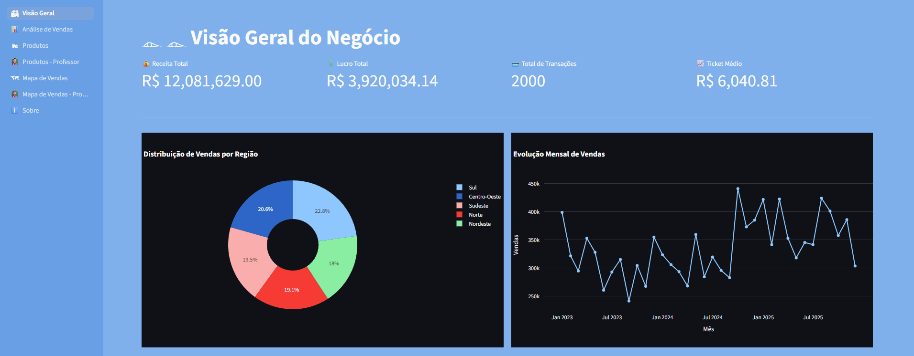
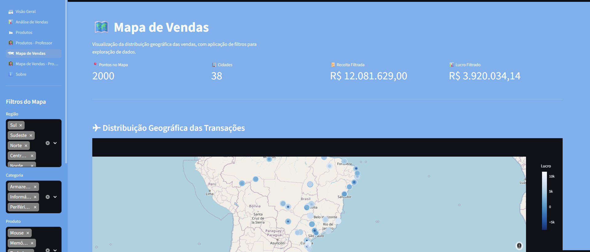

# 📊 Dashboard de Análise de Vendas

<div align="center">



**Um dashboard interativo e moderno para análise de dados de vendas**

[](https://streamlit.io/)
[](https://www.python.org/)
[](#)

</div>

---

## 🎯 Sobre o Projeto

Este é um **dashboard interativo de análise de vendas** desenvolvido como projeto final do curso de Ciência de Dados. A aplicação oferece múltiplas perspectivas analíticas para visualizar dados de vendas, produtos e geolocalizações, permitindo insights dinâmicos e em tempo real.

---

## ✨ Principais Características

- 🏘️ **Visão Geral** - Panorama completo das vendas e métricas principais
- 📊 **Análise de Vendas** - Gráficos detalhados de performance de vendas
- 🛍️ **Análise de Produtos** - Insights sobre produtos mais vendidos e popular
- 🗺️ **Mapa de Vendas** - Visualização geográfica das vendas por região
- 👨‍🏫 **Versões Estendidas** - Análises avançadas para professores
- 🎨 **Interface Moderna** - Design responsivo e intuitivo
- ⚡ **Carregamento Rápido** - Performance otimizada com Streamlit

---

## 🚀 Tecnologias Utilizadas

| Tecnologia | Versão | Descrição |
|:---:|:---:|:---|
| 🎨 **Streamlit** | 1.28+ | Framework web para dashboards interativos |
| 🐼 **Pandas** | 2.3+ | Análise e manipulação de dados |
| 🔢 **NumPy** | 2.4+ | Computação numérica e científica |
| 📊 **Altair** | 6.0+ | Visualizações declarativas e gráficos |
| 🖼️ **Pillow** | 12.1+ | Processamento e manipulação de imagens |
| 🐍 **Python** | 3.8+ | Linguagem de programação principal |

---

## 📁 Estrutura do Projeto

```
projeto_final_dashboard/
│
├── 📄 app.py                          # Arquivo principal - Configuração do Streamlit
├── 📄 gerar_dados.py                  # Script para geração de dados fictícios
├── 📋 requirements.txt                # Dependências do projeto
├── 📖 README.md                       # Este arquivo
│
├── 📁 dados/                          # Diretório com dados
│   ├── vendas.csv                     # Dados principais de vendas
│   ├── vendas_geolocalizacao.csv      # Dados de localização geográfica
│   └── vendas_geo_resumo.csv          # Resumo dos dados geográficos
│
├── 📁 pages/                          # Páginas do dashboard
│   ├── visao_geral.py                 # 🏘️ Página de visão geral
│   ├── analise_vendas.py              # 📊 Análise de vendas
│   ├── analise_produtos.py            # 🛍️ Análise de produtos
│   ├── analise_produtos_professor.py  # 👨‍🏫 Análise produtos (professor)
│   ├── mapa_vendas.py                 # 🗺️ Mapa de vendas
│   ├── mapa_vendas_professor.py       # 👨‍🏫 Mapa de vendas (professor)
│   └── sobre.py                       # ℹ️ Página sobre
│
└── 📁 img/                            # Imagens do projeto
    ├── img1.png
    └── img2.png
```

---

## 🛠️ Instalação e Setup

### Pré-requisitos
- Python 3.8 ou superior
- pip (gestor de pacotes Python)

### Passo a Passo

**1. Clone ou baixe o repositório:**
```bash
cd projeto_final_dashboard
```

**2. Crie um ambiente virtual (opcional, mas recomendado):**
```bash
# Windows
python -m venv venv
venv\Scripts\activate

# macOS/Linux
python -m venv venv
source venv/bin/activate
```

**3. Instale as dependências:**
```bash
pip install -r requirements.txt
```

**4. Execute o aplicativo:**
```bash
streamlit run app.py
```

A aplicação será aberta automaticamente em seu navegador padrão (geralmente em `http://localhost:8501`).

---

## 📊 Páginas do Dashboard

### 🏘️ **Visão Geral**
Análise consolidada das principais métricas de vendas, incluindo:
- Total de vendas
- Número de transações
- Ticket médio
- Principais KPIs

### 📊 **Análise de Vendas**
Visualizações detalhadas de performance de vendas:
- Evolução temporal de vendas
- Comparativas por período
- Gráficos de tendências
- Relatórios de desempenho

### 🛍️ **Análise de Produtos**
Insights sobre produtos e categorias:
- Produtos mais vendidos
- Categorias populares
- Análise de margem
- Mix de produtos

### 🗺️ **Mapa de Vendas**
Visualização geográfica interativa:
- Cobertura por estado/região
- Densidade de vendas
- Performance regional
- Comparativos geográficos

### 👨‍🏫 **Versões Estendidas (Professor)**
Análises avançadas com funcionalidades adicionais para fins educacionais:
- Análises mais detalhadas
- Métricas avançadas
- Recursos pedagógicos

### ℹ️ **Sobre**
Dashboard produzido por Shanara Eshily, aluna do curso técnico Ciência de Dados

---

## 💾 Dados

O projeto utiliza datasets em formato CSV com as seguintes informações:

- **vendas.csv** - Registros detalhados de transações de vendas
- **vendas_geolocalizacao.csv** - Informações geográficas das vendas
- **vendas_geo_resumo.csv** - Resumo agregado de dados geográficos

> Os dados podem ser regenerados executando `python gerar_dados.py`

---

## 🎨 Screenshots



---

## 📝 Como Usar

1. **Navegação**: Use a barra lateral para alternar entre as diferentes páginas do dashboard
2. **Filtros**: Utilize os widgets interativos para filtrar dados por período, categoria, região, etc.
3. **Exportação**: Alguns gráficos podem ser baixados como imagens
4. **Interação**: Clique em gráficos e elementos para mais detalhes (em alguns casos)

---

## 🔧 Desenvolvimento

### Adicionando Novas Páginas

1. Crie um novo arquivo em `pages/` com o padrão `nome_pagina.py`
2. Implemente sua análise usando Streamlit e Pandas
3. Registre a página em `app.py`:

```python
nova_pagina = st.Page('./pages/nome_pagina.py',
                       title='Título da Página',
                       icon='🎯')
```

### Atualizando Dependências

Para adicionar novos pacotes:
```bash
pip install novo_pacote
pip freeze > requirements.txt
```

---

## 📚 Recursos Úteis

- [Documentação Streamlit](https://docs.streamlit.io/)
- [Pandas Documentation](https://pandas.pydata.org/docs/)
- [Altair Visualization](https://altair-viz.github.io/)
- [NumPy Guide](https://numpy.org/doc/)

---

## 👤 Autor

**Projeto Final de Ciência de Dados**
- Instituição: SENAC DF
- Data: Março 2026
- Objetivo: Demonstrar competências em análise exploratória, visualização de dados e desenvolvimento de dashboards interativos

---

## 📄 Licença

Este projeto é de código aberto e está disponível para fins educacionais e comerciais.

---

<div align="center">

**Desenvolvido com ❤️ e dados**

⭐ Se gostou, deixe uma estrela! ⭐

</div>
